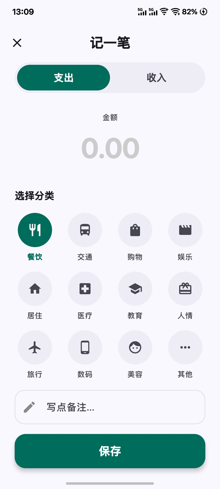

# Manage Your Bills 记账 v1.0.3


> 基于 Jetpack Compose 开发的轻量级个人记账应用。界面简洁，没有繁琐的广告，无需登录，完全免费，希望能给您带来愉快的账单记录体验！

---

## 应用截图 (v1.0.0)

| 首页概览 |                记一笔 (支出)                |                记一笔 (收入)                |
|:---:|:--------------------------------------:|:--------------------------------------:|
|  |  |  |

---

## 核心功能

### 多维度账单管理
* **实时结余统计**：首页顶部卡片实时显示本月收支结余，财务状况一目了然。
* **时间回溯**：支持在首页一键切换 “月度模式” 和 “年度模式”。通过顶部日期切换器，可轻松查看过去任何一个月或一整年的历史账单。

### 便捷记账体验
* **智能归类**：流水列表采用 Sticky Header 设计，自动按日期分组，时间线清晰明了。
* **极速录入**：大尺寸数字键盘提供类似计算器的输入体验。
* **丰富分类**：内置餐饮、交通、购物、工资、理财等 20+ 常用收支分类图标。

### 交互与细节
* **手势操作**：列表项支持左滑删除，操作丝滑流畅。
* **深色模式**：完美适配 Android 系统深色主题，夜间记账护眼舒适，告别“闪光弹”。

---

## 下载安装
欢迎访问项目[官方网站](https://seigenkouso.github.io/manage-your-bills-web/)！您也可以直接在 [Releases](https://github.com/seigenkouso/ManageYourBills/releases) 页面下载最新的 APK 安装包。

## 技术栈

本项目采用 Android 现代开发推荐架构：

* **语言**: [Kotlin](https://kotlinlang.org/) (100%)
* **UI 框架**: [Jetpack Compose](https://developer.android.com/jetbrains/compose) - 声明式 UI 工具包
* **架构模式**: MVVM (Model-View-ViewModel)
* **数据存储**: [Room Database](https://developer.android.com/training/data-storage/room) - SQLite 对象映射库
* **异步处理**: Kotlin Coroutines & Flow
* **导航**: Compose Navigation
* **状态管理**: ViewModel + StateFlow

---

## 项目结构

```text
com.example.expense
├── data
│   ├── database 
│   └── repository 
├── ui
│   ├── screens 
│   ├── components 
│   └── theme 
├── viewmodel 
└── MainActivity.kt
```
---
## 贡献

欢迎提交 Issue 或 Pull Request 来帮助改进这个项目！🤝 如果您喜欢这个项目，请为我 🌟 Star。您的鼓励是我持续优化该项目的动力！