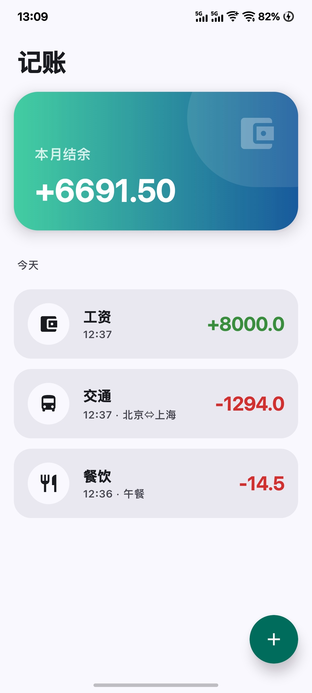
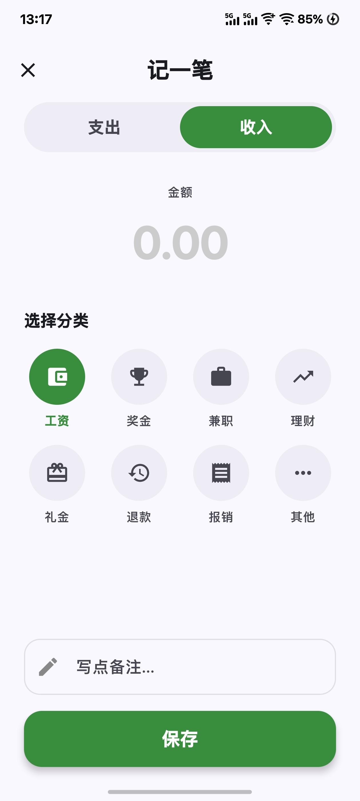

# 记账 (Manage Your Bills)


> 基于 Jetpack Compose 开发的轻量级个人记账应用。界面简洁，没有繁琐的广告，无需登录，完全免费，希望能给您带来愉快的账单记录体验！

---

## 应用截图

| 首页概览 | 记一笔 (支出) | 记一笔 (收入) |
|:---:|:---:|:---:|
|  |  |  |

---

## 功能

* **实时结余统计**：首页顶部卡片实时显示本月收支结余，红绿分明，财务状况一目了然。
* **按日归类**：流水账单采用 Sticky Header 设计，按日期自动分组，清晰直观。
* **便捷记账**：
    * 大数字输入键盘，类计算器体验。
    * 图标化分类选择，支持餐饮、交通、购物等 20+ 常用场景。
* **交互体验**：
    * 支持列表项左滑删除。
    * 支持深色模式，夜晚记账不刺眼。

---

## 技术栈

本项目采用 Android 现代开发推荐架构：

* **语言**: [Kotlin](https://kotlinlang.org/) (100%)
* **UI 框架**: [Jetpack Compose](https://developer.android.com/jetbrains/compose) - 声明式 UI 工具包
* **架构模式**: MVVM (Model-View-ViewModel)
* **数据存储**: [Room Database](https://developer.android.com/training/data-storage/room) - SQLite 对象映射库
* **异步处理**: Kotlin Coroutines & Flow
* **导航**: Compose Navigation
* **状态管理**: ViewModel + StateFlow

---

## 项目结构

```text
com.example.expense
├── data
│   ├── database 
│   └── repository 
├── ui
│   ├── screens 
│   ├── components 
│   └── theme 
├── viewmodel 
└── MainActivity.kt